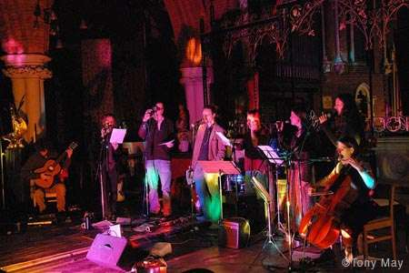

    

To date we've done a couple of sing things. The first in the Grey Horse in Kingston and the second in the big, old and lovely St.Luke's church (thanks to Father Martin Hislop....dude) as part of the 6th Amnesty freedom festival.

Eeh it were lovely! In the collaborative fashion with which our gigs seem to be heading more and more (?) we arranged and performed each other's material. Singers included Steve James and Beth Perry (from <a href="http://www.myspace.com/carrietree" title="Carrie Tree | Free Music, Tour Dates, Photos, Videos">semble</a>), <a href="http://www.myspace.com/carrietree" title="Carrie Tree | Free Music, Tour Dates, Photos, Videos">Carrie</a> - please do not operate heavy machinery whilst listening to her sing - Tree, <a href="http://www.myspace.com/esther%20wilds" title="Myspace">Esther Wilds</a> - amazing gamelan singer, <a href="http://www.myspace.com/phlipipdale" title="Phil Dale | Free Music, Tour Dates, Photos, Videos">Phil Dale</a>, <a href="http://www.myspace.com/markwoodwarden" title="mark woodward | Free Music, Tour Dates, Photos, Videos">Mark Woodward</a> and Naughty Nigel Bunner from <a href="https://www.sugardrum.com/" title="Sugardrum music : acoustic storytelling songs">Sugardrum</a>. In addition to this sumptuous vocal melange there was Matt Kelly, Andy Lodge and Mark Dusky Fisher adding to the instrumental line up of cello, guitars, bassoon, percussion (lovely deep chinese bass drum with church reverb - oooh), violin, piano and so on!

